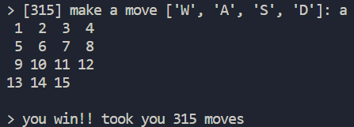
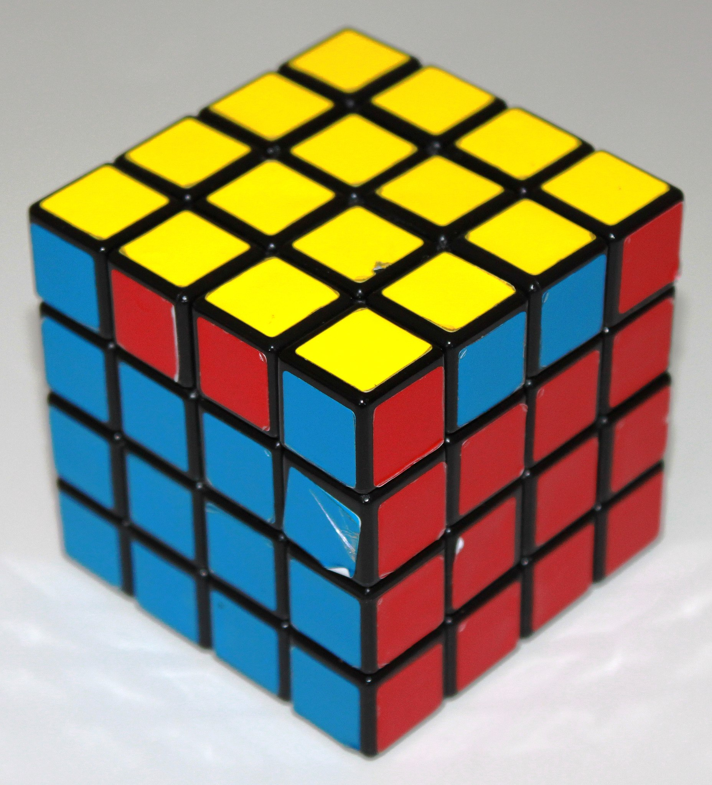

# hey guys i coded a 15 puzzle

the **15 puzzle** is a 4x4 sliding puzzle game where there are 15 tiles and one empty space. you slide tiles around on a jumbled board to put everything back in numerical order. in this version of the game you input characters denoting directions to play `(U -> up, D -> down, L -> left, R -> right)`

im lowkey trash at the game so i took 182 moves to solve it lmao

## coding process

idk one night i decided to start coding it after hearing it in a lecture and failed completely LOL

i tried again the night after and it works so yay!! as usual i kept overthinking stuff and that was super annoying but in the end everything was much simpler than i thought. 

the shuffling mechanic that happens at the start of the game was pretty weird cos i first tried to shuffle a single-dimensional translation of the array that would later be converted back to a 2d array. that worked great, until i tried playtesting the game and realised shuffling this way led to 50% of the starting positions being unsolvable due to parity, like an even-degreed rubik's cube, where 2 of the final tiles would be swapped. unlike a rubik's cube though, the 2d nature of this game meant that these were completely impossible, meaning that i had to rethink the shuffling.

i ended up relying on randomising legal moves to shuffle the board, ensuring that whatever it ended up with would be solvable, and that ended up working good enough.

